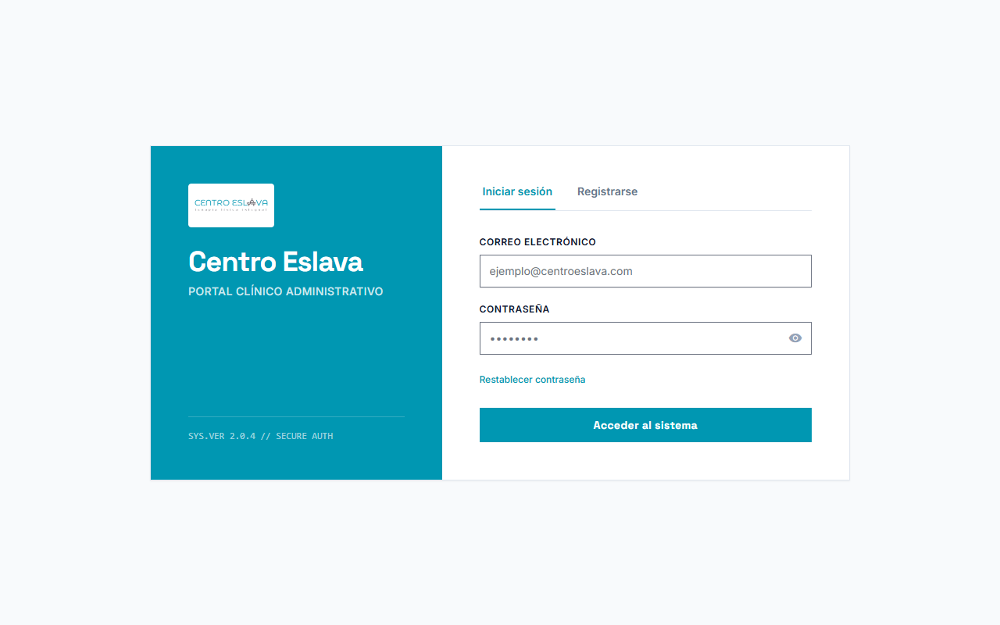
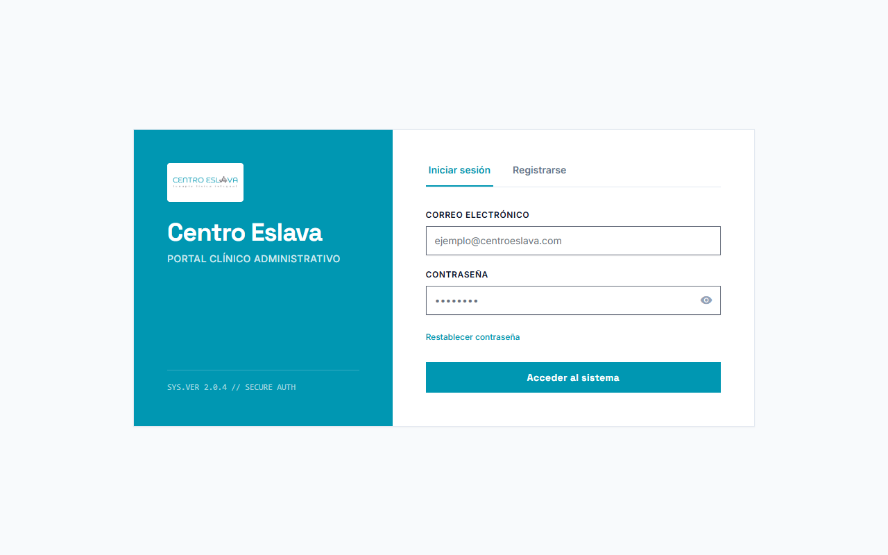
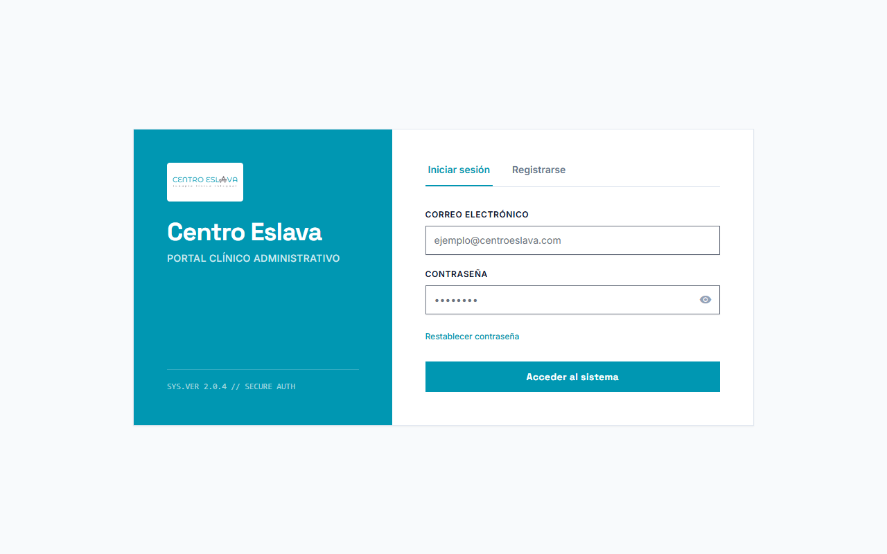
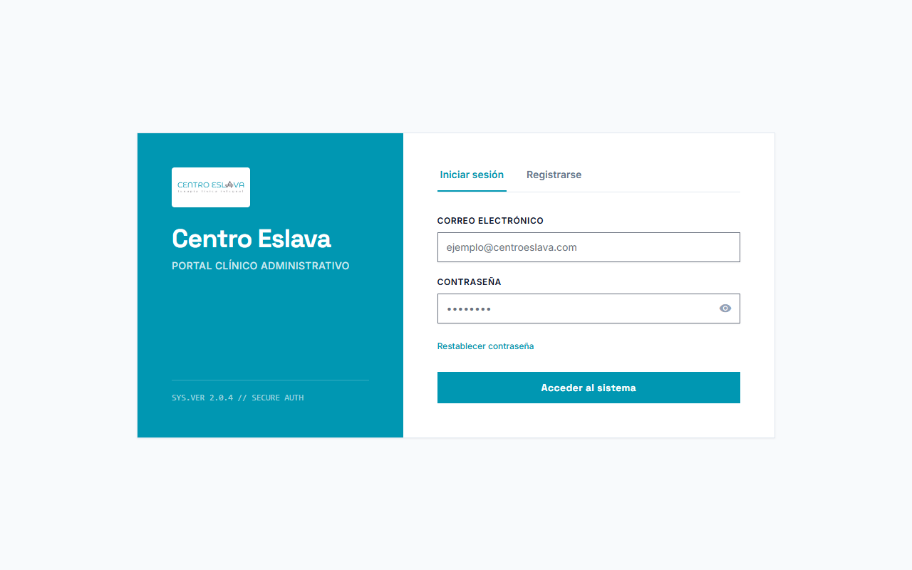

# 💆‍♂️ Centro Eslava (App Restructure) - PWA + Supabase

[](#)
[](#)
[](#)
[](#)

Restructuración completa de la aplicación web para la gestión interna del **Centro Eslava** (centro de fisioterapia y masajes especializados). Este proyecto rediseña la arquitectura hacia una PWA (Progressive Web App) modular utilizando Vanilla JavaScript, Tailwind CSS y Supabase.

## 🚀 Arquitectura y Tecnologías Clave

Este repositorio contiene la versión optimizada de la plataforma de gestión, enfocándose en la modularidad (Mobile/Desktop) y la integración de backend:

- **Frontend Modular y Adaptativo:** Vistas independientes para `desktop` y `mobile` construidas con HTML5 y estilizadas con Tailwind CSS.
- **Progressive Web App (PWA):** Soporte offline e instalable mediante `sw.js` (Service Worker) y `manifest.json`.
- **Backend Serverless (Supabase):** Implementación a través de repositorios JS integrados con Supabase para autenticación, gestión de bases de datos en tiempo real (citas, pacientes, caja) y Role-Based Access Control (RBAC).

## 🛠️ Stack Tecnológico

- **Frontend:** Vanilla JavaScript (ES6+), HTML5
- **Estilos:** Tailwind CSS
- **BaaS & Auth:** Supabase
- **Arquitectura:** Progressive Web App (PWA) + MVC (Modelo-Vista-Controlador)

## 📦 Estructura del Proyecto

El código está estructurado en capas para una mayor mantenibilidad:

- `/html`: Interfaces de usuario para escritorio y móviles.
- `/js/api/`: Capa de datos para la conexión con Supabase (e.g. `citasRepository`, `finanzasRepository`).
- `/js/controllers/`: Controladores lógicos de las vistas.
- `/js/core/`: Funcionalidades núcleo como autenticación (`auth.js`) y control de acceso (`rbac.js`).
- `/sw.js` & `manifest.json`: Archivos vitales para el funcionamiento como PWA.

## 🚀 Despliegue y Desarrollo Local

1. Clona el repositorio.
2. Configura tus credenciales basadas en `js/config/supabase.template.js`.
3. Utiliza un servidor local estático para levantar el proyecto:
   ```bash
   npx serve .
   ```

## 📸 Capturas de Pantalla

A continuación, algunas pantallas principales de la aplicación:

### Login


### Dashboard - Calendario


### Gestión de Pacientes


### Listado de Citas


### Pagos y Facturación

